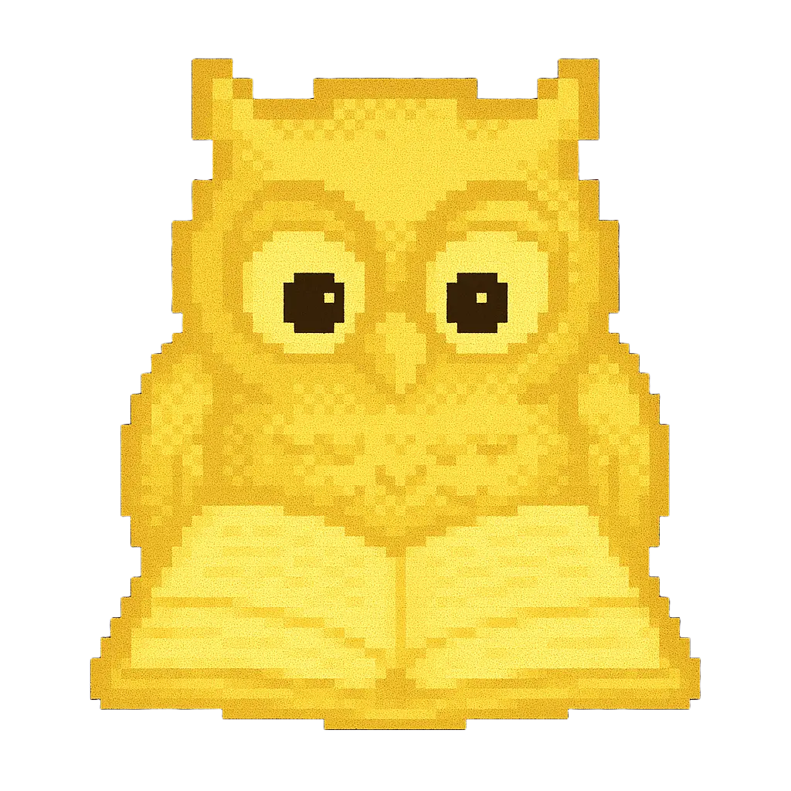
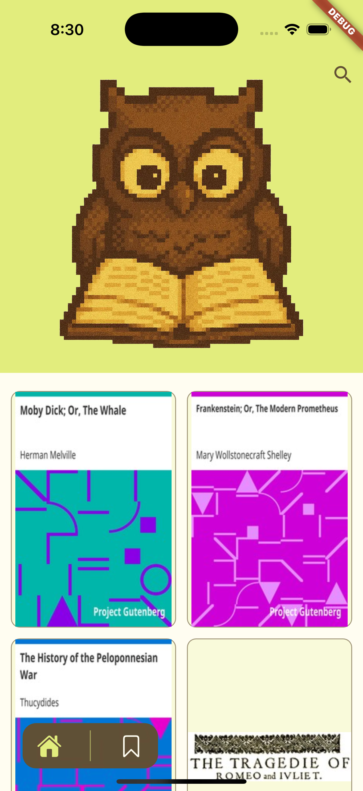
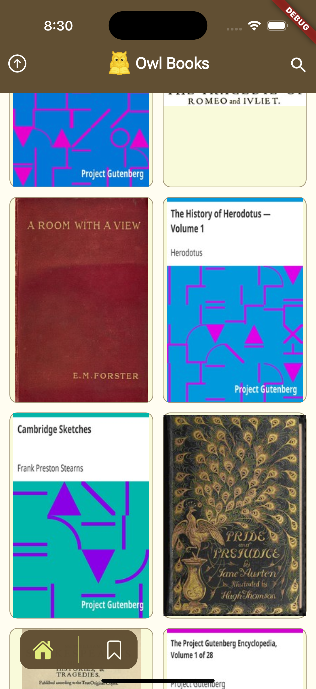
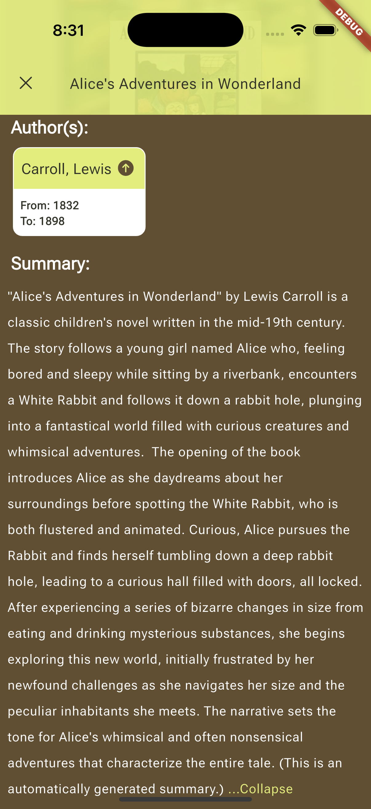

# Owl Books



_A Reading app_

---

## About

Owl Books makes it easy to browse and discover books from the Gutendex catalog.  
Infinite scrolling, powerful search, and detailed book pages (with authors, translators, and summaries) help you find and save your next read.

## Features

- **Infinite Scroll** home page for endless book listings
- **Book Details** screen showing authors, translators, and a 3-line summary
- **Search** screen to quickly find any title
- **Upcoming**: offline caching for view books details without an internet connection
- **Golden Plate**: save/bookmark your favorite books


## Screenshots

  
  
  


## Tech Stack & Architecture

**State Management**
- Cubit via `flutter_bloc`

**Service Locator**
- `get_it` + `injectable` (generated code in `service_locator.config.dart`)

**Folder Structure**
```

lib/
├── core/
│   ├── enums/
│   ├── extensions/
│   ├── failures/
│   ├── models/
│   ├── network/
│   ├── router/
│   ├── theme/
│   ├── service_locator/
│   │   ├── service_locator.dart
│   │   └── service_locator.config.dart
│   └── usecases/
├── data/
│   ├── models/
│   └── repos_impl/
├── domain/
│   ├── entities/
│   ├── repos/
│   └── usecases/
└── presentation/
├── managers/      # Cubit classes
├── views/         # Screens
└── shared/widgets/

```

**Dependencies**
- `flutter_bloc` (Cubit)
- `cached_network_image`
- `dio`
- `go_router`
- `skeletonizer`
- `google_fonts`
- `equatable`
- `toastification`
- `animated_read_more_text`

**Dev Dependencies**
- `flutter_native_splash`
- `flutter_gen` (assets codegen)
- `flutter_launcher_icons`

## Installation & Setup

1. **Flutter SDK**: version **3.27.0 – 3.32.5** (3.32.5 preferred)
2. **Clone** the repo:
   ```bash
   git clone https://github.com/nemr0/owl_books.git
   cd owl_books 
    ``` 

3. **Install packages**:

   ```bash
   flutter pub get
   ```
4. **Run** on your device or emulator:

   ```bash
   flutter run -d <device_id>
   ```

## Configuration

No extra environment variables or flavors are required.
Owl Books consumes the [Gutendex API](https://gutendex.com/) under the hood.

## Testing

There are currently no automated tests.

## Design Decisions & Assumptions

* **Error Handling**

    * **Network errors**: show a retry option
    * **Server & other errors**: display a generic “Server error” message
* **Summary**: always show at least 3 lines
* **Contributors**: translators appear alongside authors
* **Performance**: used `.builder` constructors (e.g. `GridView.builder`) for efficient list rendering

## Roadmap

* [ ]  Offline caching
* [ ]  Search

